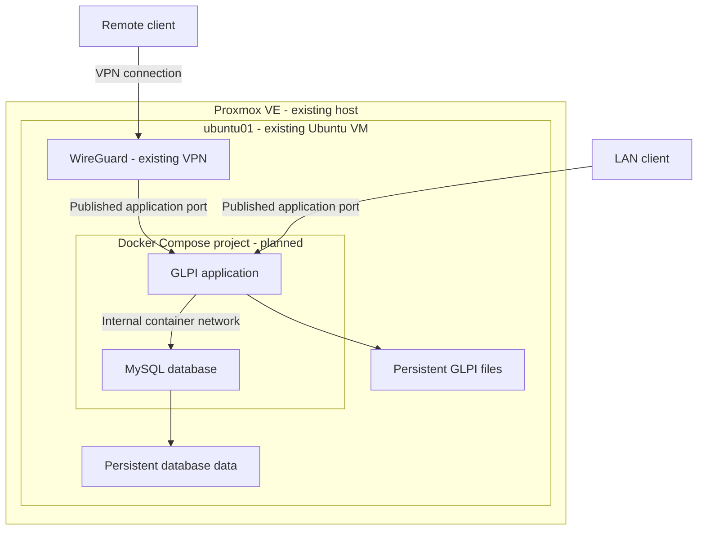

# Docker & Containers

> Part 4 of the IT-HomeLab Series
>
> This repository documents my Docker and container administration work in a practical HomeLab environment. The project focuses on deploying services, managing containers, working with persistent data, and troubleshooting common problems.
>
> **Status:** 🚧 Planning & Preparation
>
> **Note:** This repository covers **Part 4 – Docker & Containers**. Linux administration is covered in Part 3. Advanced operations, backup automation, monitoring, and security are planned for Part 5. The next practical project will focus on IT support and troubleshooting.

---

## Table of Contents

- [Project Overview](#project-overview)
- [Project Objectives](#project-objectives)
- [Technology Stack](#technology-stack)
- [Hardware & Environment](#hardware--environment)
- [Architecture](#architecture)
- [Repository Structure](#repository-structure)
- [Project Roadmap](#project-roadmap)
- [Project Timeline](#project-timeline)
- [Documentation Approach](#documentation-approach)
- [Next Project](#next-project)
- [IT-HomeLab Series](#it-homelab-series)

---

## Project Overview

In Part 3, I configured an Ubuntu Server and worked with Linux users, permissions, services, networking, SSH, WireGuard, and Active Directory integration.

This project builds on that environment. I will use the existing `ubuntu01` server to run and manage a small number of containers.

The focus is on common system administration tasks: deploying a service, changing its configuration, checking logs, managing data, and solving connection problems.

I will start with Docker commands, then use Compose to deploy GLPI and its database. GLPI will be the ticket system for a separate **IT Support & Troubleshooting Lab**.

The aim is to prepare a small, working environment and move on to realistic support scenarios. New services will be added only when a practical task needs them.

---

## Project Objectives

- Understand Docker images, containers, and the Docker Engine.
- Install Docker Engine and the Compose plugin.
- Manage the container lifecycle and inspect logs.
- Use volumes and bind mounts for persistent data.
- Configure container networks and published ports.
- Manage services with Docker Compose.
- Deploy GLPI and its database with persistent storage.
- Verify a basic backup and restore before keeping support records.
- Prepare the ticket system for practical IT support scenarios.

---

## Technology Stack

| Technology | Role | Status |
|:---|:---|:---|
| Proxmox VE | Virtualization platform | Existing |
| Ubuntu Server | Docker host | Existing |
| SSH & WireGuard | Administration and remote access | Existing |
| nftables | Existing host firewall and VPN rules | Existing |
| Docker Engine | Run and manage containers | Planned |
| Docker Compose | Define and manage services in YAML files | Planned |
| Nginx | Small reusable example for Docker basics, storage, and networking | Planned |
| GLPI Community | Ticket system for HomeLab support scenarios | Planned |
| MySQL | Database for GLPI, following the official Docker example | Planned |

Docker CLI and Compose will be used for administration. The initial setup will use GLPI and its database without extra management platforms. Compatible image versions will be checked before installation.

---

## Hardware & Environment

| Component | Details |
|:---|:---|
| Physical host | Mini PC with AMD Ryzen 5 7430U |
| Host resources | 16 GB RAM, 512 GB SSD |
| Hypervisor | Proxmox VE |
| Docker host | Existing Ubuntu Server VM: `ubuntu01` |
| VM CPU | 2 vCPU |
| VM memory reported by Linux | Approximately 3.3 GiB during the initial check |
| Available VM memory | Approximately 2.9 GiB during the initial check |
| System filesystem | 30 GB, approximately 22 GB free |
| Additional storage | Approximately 24 GB mounted at `/srv/data` |
| Administration | SSH from MacBook |
| Service access | HomeLab LAN and existing WireGuard VPN |

Resource values are from the initial planning checks. Only a small number of containers will run at the same time.

---

## Architecture

### Planned Architecture

The host and WireGuard already exist. Docker, GLPI, and MySQL are planned.

Only the application port will be published for user access. MySQL will remain on the container network. Existing host firewall rules and access will be verified during deployment.

Docker will run inside the existing `ubuntu01` VM on Proxmox. This avoids the extra resource use of a separate Docker VM.

The server already provides WireGuard access and uses Active Directory authentication through SSSD. These services will remain in place. Containers will not require domain membership for the planned exercises.

Before installation, I will review the persistent nftables configuration and prepare a recovery point. After installation, I will test SSH, WireGuard, AD authentication, and container connectivity.

Application access will initially use the LAN and WireGuard. Published ports and Docker's firewall rules will be checked alongside the existing firewall configuration.

GLPI and MySQL will run as separate services in one Compose project. The database will be reachable through the container network without publishing its port to the LAN. Application files and database data will use persistent storage. The separate `/srv/data` filesystem is available; exact storage locations will be decided during implementation.

GLPI will initially use local requester and technician accounts. Existing host AD authentication will remain separate from GLPI login. Resource use will be measured before the system is used for ongoing support work.

---

## Repository Structure

| Path | Contents |
|:---|:---|
| `README.md` | Project overview, roadmap, and timeline |
| `docs/<phase>/README.md` | Configuration, tests, results, and lessons from each phase |
| `docs/<phase>/images/` | Selected screenshots |
| `docs/<phase>/` | Relevant Compose files and other configuration examples |

Phase folders and links will be added as the work progresses.

---

## Project Roadmap

This revised five-phase roadmap is the working draft. The first four phases will reuse one small Nginx example. The final phase will apply these skills to GLPI.

### ⏳ Phase 1 – Docker Fundamentals, Installation & Container Basics

Install Docker Engine and Compose, understand images and containers, and run a small Nginx container. Practice listing, starting, stopping, inspecting, removing containers, and reading logs. Verify that existing host services still work.

### ⏳ Phase 2 – Docker Storage & Container Data

Use the same example to work with volumes and bind mounts. Recreate a container, verify which data remains, and check basic file permissions.

### ⏳ Phase 3 – Docker Networking

Work with a user-defined bridge network, container name resolution, and published ports. Check the firewall interaction and test access from the LAN and WireGuard. Investigate a simple connection problem.

### ⏳ Phase 4 – Docker Compose

Move the existing example into a Compose file. Work with environment variables, persistent storage, restart policies, logs, and container recreation. Keep the configuration small and reusable.

### ⏳ Phase 5 – GLPI Ticket System with Docker Compose

Deploy GLPI and MySQL using the official Docker example as a starting point. Configure persistent storage, database credentials, and access from the HomeLab.

Create a requester account, a technician account, and a few support categories. Test the complete process by opening, assigning, updating, resolving, and closing a sample ticket.

Before moving to support scenarios:

- Verify that tickets and attachments remain after container recreation.
- Check service startup after a host reboot and recheck existing host services.
- Measure memory and disk use with the application running.
- Back up the database and required application files, then verify recovery using test data.
- Save the Compose configuration and a short set of administration commands.

GLPI will be the ticket system for HomeLab support scenarios. These scenarios, including troubleshooting steps and verified solutions, will be documented in a separate repository: [IT Support & Troubleshooting Lab][support-lab].

Official installation reference: [Running GLPI on Docker](https://help.glpi-project.org/tutorials/procedures/running_glpi_on_docker).

---

## Project Timeline

| Date | Milestone | Status |
|:---|:---|:---|
| 03-10-2026 | Initial resource and firewall checks; selected `ubuntu01` as the Docker host | ✅ Completed |
| 03-10-2026 | Repository overview and initial roadmap prepared | ✅ Completed |
| 06-10-2026 | GLPI selected; simplified five-phase roadmap drafted for review | ✅ Completed |
| — | Phase 1 – Docker Fundamentals, Installation & Container Basics | ⏳ Planned |
| — | Phase 2 – Docker Storage & Container Data | ⏳ Planned |
| — | Phase 3 – Docker Networking | ⏳ Planned |
| — | Phase 4 – Docker Compose | ⏳ Planned |
| — | Phase 5 – GLPI Ticket System with Docker Compose | ⏳ Planned |

Actual completion dates will be added after each phase has been implemented and tested.

---

## Documentation Approach

Each phase will record what I configured, why it was needed, how I tested it, and what I learned. Notes will stay short and focus on actual work and useful results.

The documentation will include short explanations, relevant commands, useful screenshots, and any troubleshooting results. Passwords, tokens, and sensitive connection details will not be published.

---

## Next Project

The next practical step will be **IT Support & Troubleshooting Lab**, maintained in a separate GitHub repository.

I will use GLPI to record simulated user incidents and requests, investigate them in the HomeLab, verify the solution, and close the ticket. Examples include shared-folder access problems, locked accounts, DNS failures, printing problems, and stopped services.

Each case will include the ticket summary, symptoms, checks, cause, solution, and verification. Screenshots will show useful evidence, and all cases will be clearly labelled as HomeLab simulations.

This Docker repository will document installation and configuration. The support repository will document the investigations and solutions.

**Part 5 – Linux Operations** remains planned for deeper work on backup, monitoring, logging, security, and maintenance. It is not a requirement for starting the support lab; operational work can follow needs found during the scenarios.

---

## IT-HomeLab Series

| Part | Focus |
|:---|:---|
| Part 1 | [Windows Infrastructure](https://github.com/ali-turkoglu/IT-HomeLab-Windows-Infrastructure) |
| Part 2 | [Cloud & Identity](https://github.com/ali-turkoglu/IT-HomeLab-Cloud-Identity) |
| Part 3 | [Linux Administration](https://github.com/ali-turkoglu/IT-HomeLab-Linux-Administration) |
| **Part 4** | **Docker & Containers – this repository** |
| Part 5 | Linux Operations – planned |

**Related project:** [IT Support & Troubleshooting Lab][support-lab] – planned as the next practical focus.

[← Back to IT HomeLab Journey](https://github.com/ali-turkoglu/IT-HomeLab-Journey)

---

## License

This project is licensed under the MIT License.

See the [LICENSE](LICENSE) file for more information.

<!-- Replace #next-project below with the support repository URL when it is available. -->
[support-lab]: #next-project
