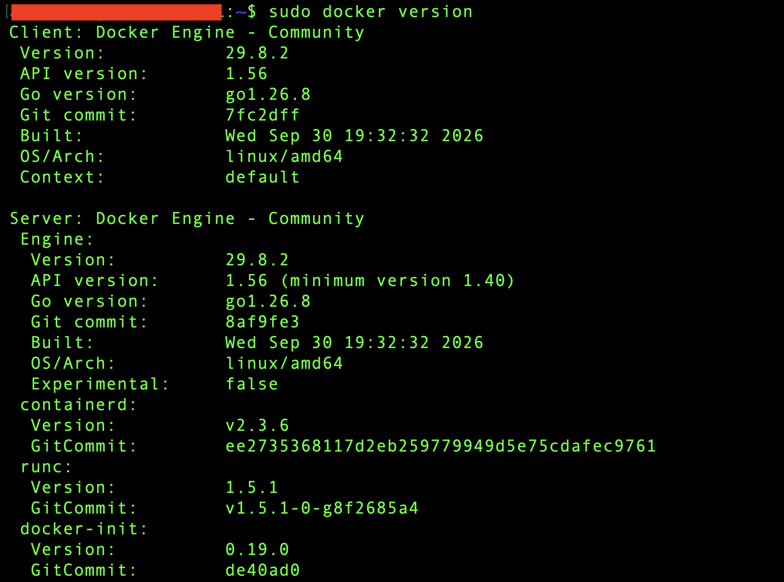
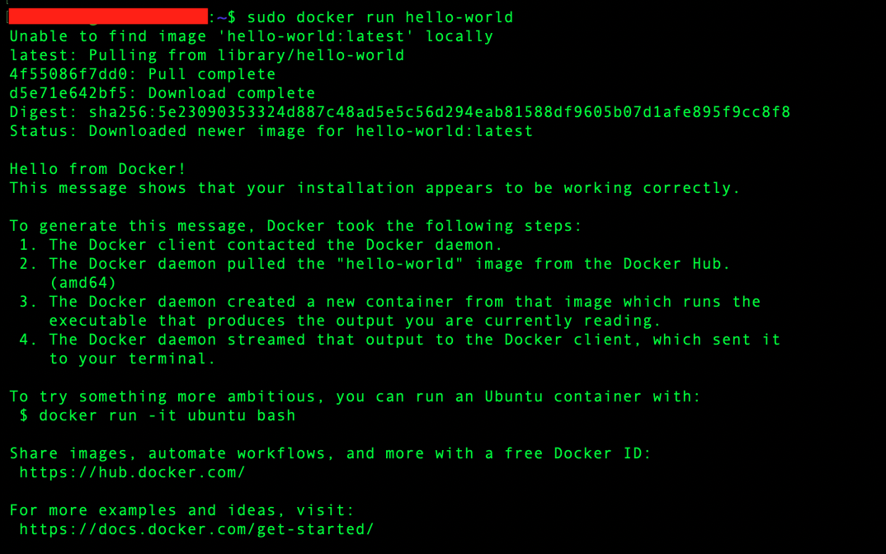
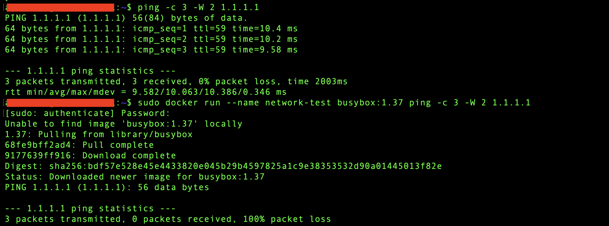
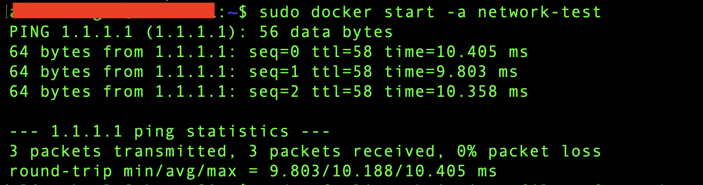
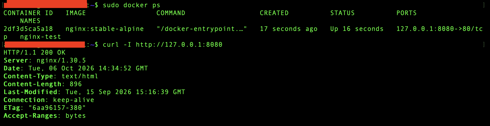
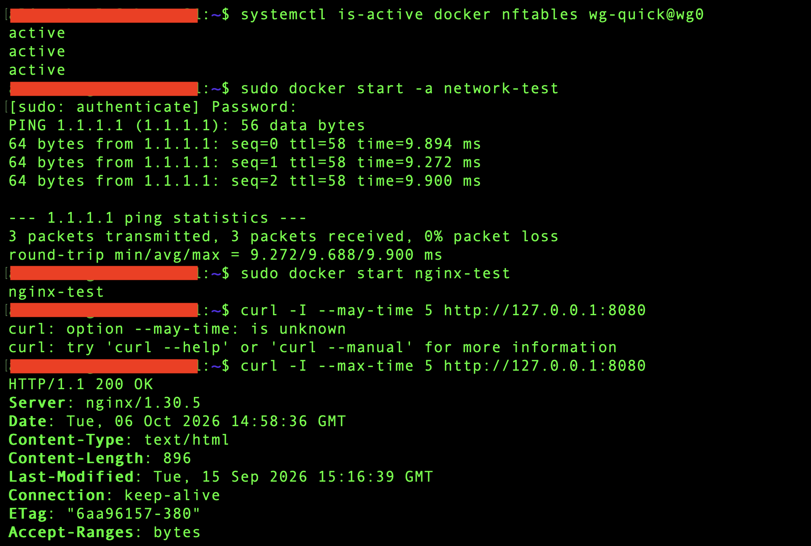

# Phase 1 – Docker Fundamentals, Installation & Container Basics

> **Status:** ✅ Completed

---

## Purpose & Objectives

The goal of this phase was to install Docker Engine on `ubuntu01`, understand images and containers, and practice basic container management.

The main objectives were:
- Install and verify Docker Engine.
- Run containers and manage their lifecycle.
- Check logs, resource usage, and commands inside containers.
- Investigate a container network problem.
- Verify Docker and existing WireGuard access after reboot.

---

## Environment

| Component | Detail |
|:---|:---|
| Host | `ubuntu01` — Ubuntu Server VM on Proxmox VE |
| Operating System | Ubuntu Server 26.04.1 LTS |
| Architecture | x86_64 / amd64 |
| Memory detected before installation | Approximately 1.5 GiB |
| System disk | 30 GB, with 22 GB available before installation |
| Docker Engine | Community Edition 29.8.2 |
| Existing services | SSH, nftables firewall, and WireGuard |
| Test images | `hello-world:latest`, `busybox:1.37`, `nginx:stable-alpine` |

---

## 1. Preparation & Installation

Before installation, I checked the Ubuntu version, architecture, memory, and available disk space:

```bash
cat /etc/os-release
uname -m
free -h
df -h /
```

I also reviewed the active and saved firewall rules:

```bash
sudo nft list ruleset
sudo cat /etc/nftables.conf
iptables --version
```

The server already used nftables for SSH access and WireGuard routing. The iptables version showed the `nf_tables` backend.

I checked for existing container packages. No installed packages matched this check:

```bash
dpkg -l | grep -E '^ii[[:space:]]+(docker|containerd|runc|podman)'
```

Before changing the firewall configuration, I created a backup:

```bash
sudo cp -a /etc/nftables.conf /etc/nftables.conf.pre-docker
```

I then followed the official Docker installation guide to add the signing key and APT repository and install Docker Engine with the related packages.

After installation, I checked the service and version:

```bash
sudo systemctl status docker --no-pager
sudo docker version
```

Docker was running and enabled to start at boot. Both the Client and Server reported version `29.8.2`.

I used `sudo` for Docker commands during this phase.



---

## 2. First Container & Basic Management

Docker Engine runs inside the Ubuntu VM. Linux containers share the host's kernel, while each container has its own filesystem and processes.

I started with the `hello-world` image:

```bash
sudo docker run hello-world
```

Docker downloaded the image, created a container, and displayed the confirmation message.



I listed the local images and containers:

```bash
sudo docker image ls
sudo docker ps
sudo docker ps -a
```

The container showed `Exited (0)`, meaning its program had finished successfully. It appeared with `docker ps -a`, but not in the list of running containers.

Docker assigned the automatic name `busy_rhodes`. I used this name to read its logs and start it again:

```bash
sudo docker logs busy_rhodes
sudo docker start -a busy_rhodes
```

The same message appeared again, and the container ID stayed the same. This helped me understand the difference between creating a new container with `run` and starting an existing one with `start`.

I then removed the stopped container:

```bash
sudo docker rm busy_rhodes
```

The container was removed, but the image remained available locally.

---

## 3. Container Network Troubleshooting

### Initial Test

I compared access to the same external IP from the Ubuntu host and a BusyBox container:

```bash
ping -c 3 -W 2 1.1.1.1
sudo docker run --name network-test busybox:1.37 ping -c 3 -W 2 1.1.1.1
```

The host received all three replies. The container received no replies and showed 100% packet loss.

Using an IP address kept DNS out of this test. The successful image download did not prove container connectivity, because the host's Docker service downloaded the image.



### Firewall Change & Verification

The existing nftables `forward` chain had a drop policy. It allowed WireGuard traffic to the HomeLab network, but had no rule for new outbound connections from the default Docker bridge.

I added a rule for traffic from `docker0` through `ens18`:

```bash
sudo nft add rule inet filter forward iifname "docker0" oifname "ens18" ip saddr 172.17.0.0/16 counter accept
```

I then repeated the test using the same container:

```bash
sudo docker start -a network-test
sudo nft list chain inet filter forward
```

All three replies were received after the change. This confirmed that the existing forwarding policy had blocked this test.



### Saving the Configuration

I added the Docker forwarding rule to `/etc/nftables.conf`.

The file previously contained `flush ruleset`, which would also remove Docker-managed rules when loaded. I replaced it with commands that refresh only my own tables:

```text
add table inet filter
flush table inet filter
add table ip homelab_nat
flush table ip homelab_nat
```

The table definitions below these commands restore my rules when the file is loaded.

I also moved the WireGuard NAT rule into a separate table named `homelab_nat`. Docker's NAT rules remained in `ip nat`.

I checked the file before applying it:

```bash
sudo nft -c -f /etc/nftables.conf
sudo nft -f /etc/nftables.conf
```

The `-c` option checks the configuration without applying it.

After verifying the new NAT table, I removed the old WireGuard-only `postrouting` chain from `ip nat`. The container ping test still passed, and Proxmox remained reachable through WireGuard over mobile data.

The Docker forwarding rule covers the default `docker0` bridge. Additional container networks will need to be reviewed in later phases.

---

## 4. Nginx Container & Lifecycle Tests

I used Nginx to practice managing a continuously running web service:

```bash
sudo docker run -d --name nginx-test -p 127.0.0.1:8080:80 nginx:stable-alpine
```

The container ran in the background with the name `nginx-test`.

I mapped port `8080` on the host's loopback address to port `80` inside the container. This kept the web test accessible locally from Ubuntu.

The `stable-alpine` tag selects the Alpine-based stable Nginx image. It is a moving tag, so future downloads may use a newer version.

I checked the container and HTTP response:

```bash
sudo docker ps
curl -I http://127.0.0.1:8080
sudo docker logs nginx-test
```

Nginx returned `200 OK`. Its logs included the successful `HEAD` request from `curl -I`.

The Nginx version used during this test was `1.30.5`.



I stopped the container and checked it again:

```bash
sudo docker stop nginx-test
sudo docker ps -a
curl -I --max-time 5 http://127.0.0.1:8080
```

The container showed `Exited (0)`, and the HTTP connection failed as expected.

I then started the same container again:

```bash
sudo docker start nginx-test
curl -I --max-time 5 http://127.0.0.1:8080
```

The response returned to `200 OK`.

I also tested `docker restart` and repeated the HTTP check:

```bash
sudo docker restart nginx-test
curl -I --max-time 5 http://127.0.0.1:8080
```

The service responded successfully after the restart.

---

## 5. Container Inspection & Resource Usage

I used `docker exec` to check the Nginx version inside the running container:

```bash
sudo docker exec nginx-test nginx -v
```

I also opened an interactive shell:

```bash
sudo docker exec -it nginx-test sh
```

Inside the container, I checked the distribution and web files:

```sh
cat /etc/os-release
ls /usr/share/nginx/html
exit
```

The image used Alpine Linux 3.24.2. The web directory contained `index.html` and `50x.html`.

Leaving the shell did not stop Nginx, because the shell was an additional process started with `docker exec`.

I checked resource usage with:

```bash
sudo docker stats --no-stream nginx-test
```

Nginx used about 3.25 MiB of memory during this light-load test. No custom memory limit was configured.

---

## 6. Verification After Reboot

Before rebooting, I checked that Docker, nftables, and WireGuard were enabled:

```bash
systemctl is-enabled docker nftables wg-quick@wg0
```

After rebooting and reconnecting through SSH, I checked the services and manually started the test containers:

```bash
systemctl is-active docker nftables wg-quick@wg0
sudo docker start -a network-test
sudo docker start nginx-test
curl -I --max-time 5 http://127.0.0.1:8080
```

All checks passed:
- Docker, nftables, and WireGuard were active.
- The container received all three ping replies.
- Nginx returned `200 OK`.
- Proxmox was reachable through WireGuard over mobile data.

The containers were started manually because no automatic restart policy was configured.



---

## 7. Cleanup

After completing the tests, I stopped Nginx and removed both test containers:

```bash
sudo docker stop nginx-test
sudo docker rm nginx-test network-test
sudo docker ps -a
```

The container list was empty. The downloaded images remained available locally.

---

## Lessons Learned

- Images and containers are managed separately.
- A container stops when its main process finishes.
- Logs can be read after a container stops.
- Commands can be run inside a container without stopping its main service.
- Existing firewall rules can affect container networking.
- Docker service startup and container automatic startup are separate settings.

---

## Result

Docker Engine was installed and tested on `ubuntu01`.

I practiced container management, logs, shell access, port mapping, and resource checks. I also resolved an outbound container network problem and verified Docker and WireGuard after reboot.

---

## References

- [Install Docker Engine on Ubuntu](https://docs.docker.com/engine/install/ubuntu/)
- [Docker CLI Reference](https://docs.docker.com/reference/cli/docker/)
- [Container Management Commands](https://docs.docker.com/reference/cli/docker/container/)
- [Nginx Official Image and Tags](https://hub.docker.com/_/nginx)
- [Docker Networking and Firewall Rules](https://docs.docker.com/engine/network/packet-filtering-firewalls/)
- [nftables Manual](https://netfilter.org/projects/nftables/manpage.html)

---

## Navigation

| Home | Next |
|:----:|:----:|
| 🏠 [Home](../../README.md) | ➡️ [Phase 2 – Docker Persistent Storage & Portainer](../2-Docker-Persistent-Storage-Portainer/README.md) |
