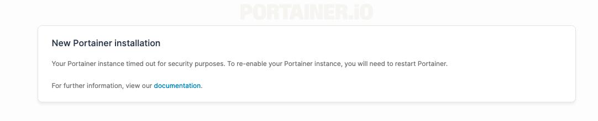
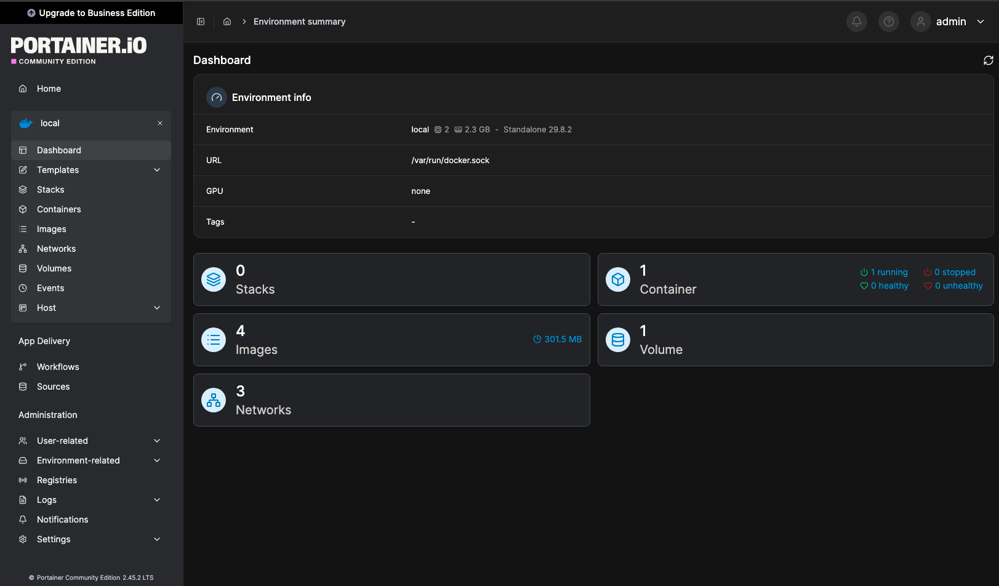
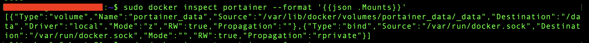
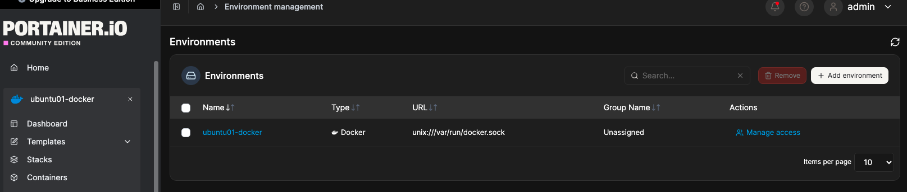
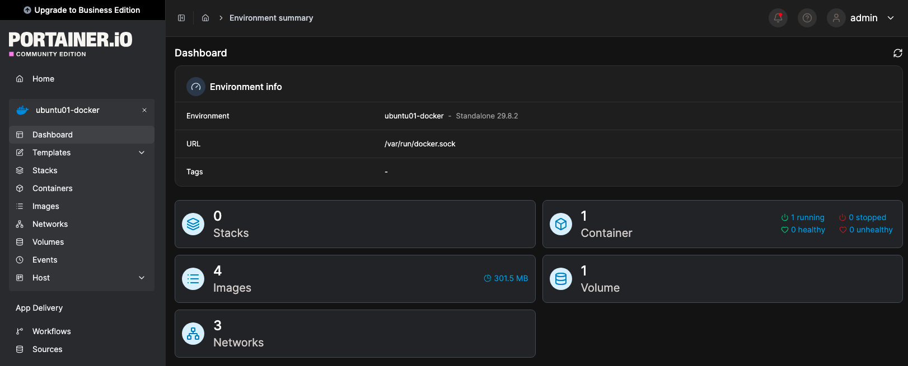

# Phase 2 – Docker Persistent Storage & Portainer

> **Part 4 – Docker & Containers**
>
> **Status:** ✅ Completed

---

## Purpose & Objectives

I installed Portainer to manage Docker through a web interface and keep it as part of the HomeLab. This also gave me a practical way to test persistent storage with a service I will continue using.

The main goal was to remove and recreate the Portainer container without losing its administrator account or settings.

---

## Environment

| Component | Detail |
|:---|:---|
| Server | `ubuntu01` – Ubuntu Server |
| Docker Engine | 29.8.2 |
| Portainer | Community Edition 2.45.2 LTS |
| Image used | `portainer/portainer-ce:lts` |
| Persistent volume | `portainer_data` |
| Administration device | MacBook |
| Web access | HTTPS through an SSH tunnel |

Before installation, I checked Docker and the server resources. There were no existing containers or volumes. About 1.3 GiB of memory and 22 GB of disk space were available.

---

## Storage and Installation

I used two mounts with different purposes:

| Type | Source on Ubuntu | Container path | Purpose |
|:---|:---|:---|:---|
| Named volume | `portainer_data` | `/data` | Store Portainer's accounts and settings |
| Bind mount | `/var/run/docker.sock` | `/var/run/docker.sock` | Give Portainer access to Docker Engine |

The named volume keeps Portainer's data separate from the container. The socket bind mount allows Portainer to manage the local Docker environment.

I created the volume and checked its details with `inspect`:

```bash
sudo docker volume create portainer_data
sudo docker volume inspect portainer_data
```

The output showed the `local` driver and the mountpoint `/var/lib/docker/volumes/portainer_data/_data`.

I downloaded the image and started Portainer with both mounts:

```bash
sudo docker pull portainer/portainer-ce:lts

sudo docker run -d \
  --name portainer \
  --restart=unless-stopped \
  -p 127.0.0.1:9443:9443 \
  -v /var/run/docker.sock:/var/run/docker.sock \
  -v portainer_data:/data \
  portainer/portainer-ce:lts
```

The container runs in the background with automatic restart enabled unless manually stopped. Port 9443 is published only on Ubuntu's localhost address. Port 8000 was not needed because I did not use Edge Agents.

The installed version was 2.45.2 LTS. The `lts` tag may point to a different version in future installations.

---

## Management Access

The Docker socket gives Portainer powerful management access. I kept the web interface on localhost and connected from the MacBook through an SSH tunnel using my existing SSH key.

```bash
ssh -i ~/.ssh/id_ed25519_ubuntu01 \
  -N -L 9443:127.0.0.1:9443 \
  ********@<ubuntu-lan-ip>
```

`-i` selects the key, `-N` opens the connection without a remote shell, and `-L` forwards the local port. The server's LAN address is replaced with a placeholder here.

I accessed Portainer at `https://localhost:9443` in the MacBook browser. I also added a `portainer` entry to `~/.ssh/config` to save the key and tunnel settings for the shorter command `ssh portainer`.

The tunnel needs to remain open while using the interface. No additional router port forwarding was configured. Access from an external network through WireGuard was not tested in this phase.

---

## Initial Setup and Troubleshooting

The first setup page showed a security timeout.



I restarted the container and refreshed the browser:

```bash
sudo docker restart portainer
```

During account creation, I also received a 403 error. After restarting and retrying the initial setup, account creation succeeded. Troubleshooting included checking the setup-token requirements and the recent container logs:

```bash
sudo docker logs --tail 50 portainer
```

`--tail 50` limits the output to the last 50 log lines. Setup tokens are not included in this documentation.

I created the administrator account and skipped Edge Compute. Portainer detected the local Docker environment through the socket connection. The dashboard showed one running container and one volume.



---

## Mount Verification

I checked the mounts attached to the running container:

```bash
sudo docker inspect portainer --format '{{json .Mounts}}'
```

The format option shows only the mount information. The output confirmed a `volume` mounted at `/data` and a `bind` mount for the Docker socket. Both had read and write access (`RW: true`).



---

## Container Recreation Test

I changed the environment name from `local` to `ubuntu01-docker`. This gave me a saved setting to compare before and after removing the container.



I recorded the container ID, stopped Portainer, and removed the container. The management interface was temporarily unavailable during this test.

```bash
sudo docker ps -a
sudo docker stop portainer
sudo docker rm portainer
sudo docker volume ls
```

`ps -a` showed the original container ID. After `stop` and `rm`, `volume ls` confirmed that `portainer_data` was still present. I kept this volume and recreated Portainer with the same `docker run` command and the existing local image.

I then logged in with the previous administrator account and checked the environment name. A final `sudo docker ps` confirmed that the new container was running.

| Check | Result |
|:---|:---|
| Original container ID | `f6fca79a0d3c` |
| New container ID | `5602dada3251` |
| Existing administrator login | Successful |
| Environment name | `ubuntu01-docker` preserved |
| Local Docker connection | Working |



The container ID changed, but the account and saved environment name remained available through the same named volume.

---

## Lessons Learned

This test helped me understand how application data can remain available when a container is replaced. The named volume stored Portainer's data, while the bind mount provided access to the Docker socket.

Persistent storage still needs a backup. Keeping a volume does not protect its contents from disk failure or accidental deletion.

---

## Result

Portainer is running and accessible from the MacBook through an SSH tunnel. Its account and settings survived container recreation. I will continue using it for Docker administration in the following phases.

---

## References

- [Portainer CE – Docker on Linux](https://docs.portainer.io/start/install-ce/server/docker/linux)
- [Portainer – Initial Setup](https://docs.portainer.io/start/install-ce/server/setup)
- [Portainer – Setup Token](https://docs.portainer.io/faqs/installing/setup-token)
- [Docker – Volumes](https://docs.docker.com/engine/storage/volumes/)
- [Docker – Bind Mounts](https://docs.docker.com/engine/storage/bind-mounts/)
- [Docker – Port Publishing](https://docs.docker.com/engine/network/port-publishing/)

---

## Navigation

| Previous | Home | Next |
|:--------:|:----:|:----:|
| ⬅️ [Phase 1 – Docker Fundamentals, Installation & Container Basics](../1-Docker-Fundamentals-Installation-Container-Basics/README.md)| 🏠 [Home](../../README.md) | ➡️ Phase 3 - Phase 3 – Docker Networking ***Coming Soon***|
